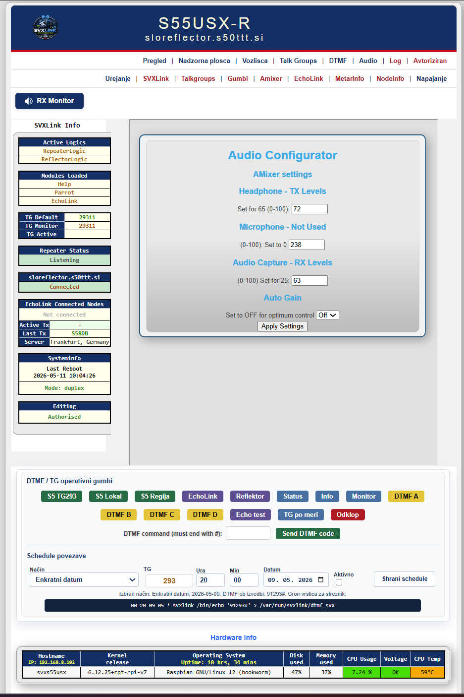

# SVXLink-Dashboard-V2
<h1>SVXLink Node dashboard repository inspired by a pi-star dashboard</h1>
<h2>Originally constructed by SP2ONG and SP0DZ, but suffered from out of date code in PHP and Javascript.

Brought up to date by Chris Jackson G4NAB with new code.</h2> 
<h3>The DTMF section is now operational subject to changes to the DTMF_CTR_PTY=/var/run/svxlink/dtmf_svx being inserted in SimplexLogic or RepeaterLogic, replacing the existing line.</h3>

<b>This installation requires that svxlink has been compiled on Debian 12 with PHP 8.2 installed. </b>

<h2>S58DB fresh install</h2>

Use these steps for a clean install of this branch on a new client.

In <b>/var/www</b> run:

<b>sudo git clone -b s58db-svxlink-dashboard https://github.com/s58DB/SVXLink-Dashboard-SI.git html</b>

<b>cd html</b>

For a first install, edit the Apache environment file:

<b>sudo nano /etc/apache2/envvars</b>

Change:

export APACHE_RUN_USER=www-data

export APACHE_RUN_GROUP=www-data

to:

export APACHE_RUN_USER=svxlink

export APACHE_RUN_GROUP=svxlink

Then edit the Apache service file. On most Debian systems it is:

<b>sudo nano /usr/lib/systemd/system/apache2.service</b>

Locate <b>PrivateTmp=true</b> and change it to <b>PrivateTmp=false</b>.

Reload systemd and restart Apache:

<b>sudo systemctl daemon-reload && sudo systemctl restart apache2</b>

Then run the dashboard setup from <b>/var/www/html</b>:

<b>sudo chmod +x upgrade.sh</b>

<b>sudo ./upgrade.sh</b>

This branch does not install or replace <b>EchoLink.tcl</b>. EchoLink connected nodes, Active TX, Last TX, and directory server location are read from the existing SvxLink log output.

If it has been installed with svxlinkbuilder then very little needs to be changed.

If you are installing it manually, then you will need to read the instructions thoroughly:

No installation script is required, simply open a terminal with ssh or putty and cd to /var/www and REMOVE any existing html folder.

If you are upgrading an existing earlier SVXLink-Dash-V2 installation, then you may be still better simply removing the existing html folder. You will lose nothing by it.

So in /var/www/ run the following command line. 

<b>sudo git clone https://github.com/f5vmr/SVXLink-Dash-V2 html</b>

<b> cd html</b>

If you are installing it for the first time, then you need to follow the next few instructions, otherwise skip to the next section Setting Up The Dashboard.

Next <b>sudo nano /etc/apache2/envvars</b> file and make the following changes

export APACHE_RUN_USER=www-data

export APACHE_RUN_GROUP=www-data

to

export APACHE_RUN_USER=svxlink

export APACHE_RUN_GROUP=svxlink

and save the file

Next locate the file /usr/lib/systemd/system/apache2.service

It may be elsewhere in your system.

You may edit it in situ or copy it to /etc/systemd/system/

Locate 'PrivateTmp=true' and change this to 'PrivateTmp=false' and save the file.

sudo systemctl daemon-reload && sudo systemctl restart apache2 to restart the webserver.

<h2>Setting up the Dashboard</h2>

While still in the <b>/var/www/html</b> folder run the following command:

<b>sudo ./upgrade.sh</b>

This file allows you, the Dashboard Owner, to run certain commands when authorised. It also adds some maintenance provisions, removing old backup files so that the system remains unburdened of old data. It also checks for the installation of nodejs and npm necessary for sound from the dashboard in your browser. This completely removes the need for installing darkice and icecast2.

Finally go to the browser of your choice and enter the ip address of your raspberry pi.

 

You will be presented with the dashboard of your device. You will need to log in under your username and password, set up during the upgrade.sh process.

The dashboard is now ready to use. However it is recommended that you thoroughly read the man page for svxlink.conf. <i>man svxlink.conf on google </i>will find a copy, although you will find one inside your device through the terminal

The first new addition is that you will find a speaker icon "Rx Monitor" on the top left of the dashboard, on which you may click to activate to hear all outbound audio to your dekstop device.

Only With Username and Password in place, will you have access to the 'Log', 'Power' and 'Edit' menus, allowing you as the sysop to expose the dashboard to public view, without someone corrupting your node. As soon as you click on the blue menus, the authorisation is rescinded. Naturally as this is a web page, all the changes take place within your local browser and not on-line. Without authorisation, the 'Log', 'Power' and Edit menus are blocked, so no one can turn off your repeater, or mess with the logic configuration.

1. Svxlink Configurator - This will only operate with an existing svxlink.conf, you cannot add lines to it with the configurator. If you need to add lines or sections, then you will have to ssh into the device.

In all of the .conf files are lines that are inactive or commented out with '#'. However in the configurator, you will see check-boxes that if ticked, are active lines. If they are unchecked they are inactive and therefore would appear in the file with # as the first character.

Your edited files will be saved in /var/www/html/backups with a date/time.
 

2. Amixer configurator removes the need to resort to sudo alsamixer, it can all be done from the dashboard. Although it may not hurt to check.

3. EchoLink Configurator. Set this up before adding ModuleEchoLink into the SimplexLogic or RepeaterLogic in the Svxlink Editor.

4. Metar Configurator. This is fairly easy to modify, but again look for the man page for ModuleMetarInfo.

5. NodeInfo Configurator. This is the file required for the proper operation of the SvxReflector if it is associated with your device. because it is a .json file, different editing techniques are required.

 In each case, the 'save' button action restarts the svxlink service, so there is no need to restart svxlink manually.

However if at any time there appears to be a 'stall' in the operation of your node or repeater, then the POWER menu can be used to restart the service, restart the raspberry completely, or even shutdown the device.

In the case of the amixer configurator, the changes will be immediately applied and viewed without restarting svxlink

Below the footer menu you will see a dtmf control facility. The D buttons are not yet programmed, and will need to correspond with the Macros in svxlink.conf so you will need to self-edit the macros in svxlink.conf.

I will eventually examine the possibility of making improvements and additions in the future.

The svxlink dashboard has some ideas created by G4NAB, W6SJM, SP2ONG, SP0DZ
and upgraded by G4NAB

<h2>Addendum</h2>
<h3>Original dashboard addendum</h3>

Additional Talk Groups can be added to the Svxlink Configurator.

Airports can be added and removed as required in the MetarInfo Configurator.

The Audio test dashboard can record a 15 second WAV sample from the SVXLink loopback monitor and show the playback peak meter for level checking.

Module EchoLink can be added throught the dashboard, in the EchoLink configurator first of all, then add ModuleEchoLink to the MODULES= line in the [SimplexLogic] or [RepeaterLogic] section of the Svxlink Configurator.

EchoLink Stations can now be identified on the sidebar, thanks to Sam W6SJM, with a small code adjustement

Amixer can be adjusted using the dashboard, and is more efficient than alsamixer in the terminal.

<h3>S58DB additions in this branch</h3>

This branch includes a Slovenian S58DB/ZRS dashboard presentation, updated fresh-install instructions for the <b>s58db-svxlink-dashboard</b> branch, and a setup flow intended for Debian 12 with PHP 8.2.

Sysop-only actions are protected by dashboard authorisation. Unauthorised users can view public dashboard information, while DTMF controls, schedule changes, log/debug views, and power or edit actions require login.

The DTMF control panel includes operational button handling and a scheduled TG change feature. Scheduled TG changes can run once, daily, weekly, monthly, or yearly, and the cron helper writes the configured TG DTMF command directly to the SvxLink DTMF control file.

The Talk Groups page can now edit the local TG name database. Changes are written to <b>include/tgdb.php</b> and are reused by the <b>SVXReflector Activity</b> table for the <b>TG Name</b> column.

The SVXReflector Activity table handles unknown TG numbers more cleanly and includes debug views for checking reflector log parsing, latest talker events, TX timing, and pause-mode behaviour.

EchoLink status is read from existing SvxLink log output instead of replacing <b>EchoLink.tcl</b>. The sidebar can show connected EchoLink nodes, active TX, last TX, and directory server or proxy information when available in the logs.

The dashboard styling and navigation have been adjusted for the S58DB edition, including the Slovenian header branding, ZRS emblem, refreshed menu treatment, and more guarded access to sensitive pages.

